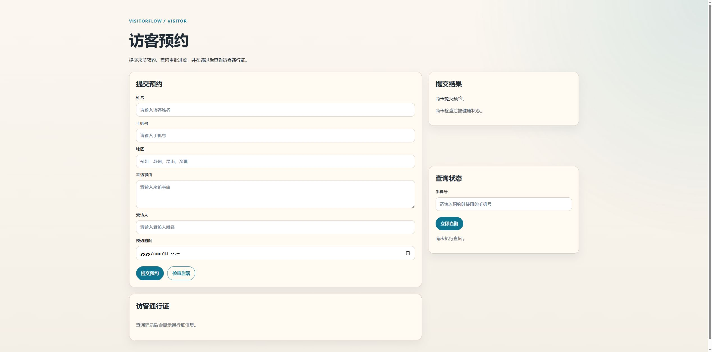

# 访客预约与审批系统

这是一个面向企业来访登记场景的访客管理原型项目，用来替代纸质登记，形成“访客预约 -> 后台审批 -> 电子凭证 -> 现场签到 -> 历史追踪”的完整闭环。

当前版本已经不是单纯骨架，而是一套可以本地运行、可以演示、可以继续工程化的完整原型。主目标端为微信小程序和 Web，其中小程序偏访客使用，Web 同时承担访客备用入口和管理员后台。



## 当前完成度

一句话总结：项目已经达到“可演示原型”阶段，后端主干基本完成。

当前已经打通的主流程：

1. 访客在 Web 或微信小程序提交预约
2. 后端生成申请记录和 6 位入场码
3. 管理员登录 Web 后台查看待审批列表
4. 管理员通过或拒绝预约
5. 访客按手机号查询审批结果
6. 审批通过后展示电子凭证和二维码
7. 管理员通过入场码或扫码完成现场签到
8. 后台查看历史记录、统计看板、最近动态和系统日志

截至 `2026-08-06`，后端测试已通过 `36` 项。

## 当前成品形态

你现在拿到的是：

- 一个模块化 FastAPI 后端
- 一个可演示的 Web 访客页
- 一个可演示的 Web 管理后台
- 一个可演示的微信小程序访客端原型
- 一套数据库迁移、日志、自动过期、Docker 和测试基础设施

适合场景：

- 本地联调
- 课程或作品展示
- 原型演示
- 继续迭代为正式项目

还不属于正式生产版的部分：

- PostgreSQL 实际生产切换
- HTTPS 与正式部署方案
- 更细的角色权限模型
- 备份、监控、运维体系
- 前端组件化和工程化重构

## 当前界面

### 接口调试界面

启动后端后可以直接访问：

- `http://127.0.0.1:8000/docs`
- `http://127.0.0.1:8000/redoc`

### Web 页面

后端启动后即可直接访问：

- `http://127.0.0.1:8000/`
- `http://127.0.0.1:8000/visitor.html`
- `http://127.0.0.1:8000/admin.html`

对应文件：

- [index.html](visitor_system/frontend/web/index.html)
- [visitor.html](visitor_system/frontend/web/visitor.html)
- [admin.html](visitor_system/frontend/web/admin.html)

### 微信小程序

小程序原型目录：

- [miniprogram](visitor_system/frontend/miniprogram)

包含页面：

- 预约申请
- 提交结果
- 手机号查询
- 电子凭证

## 技术栈

- 后端：Python 3.14、FastAPI、SQLAlchemy、Pydantic、Alembic、Loguru
- 数据库：开发期默认 SQLite，已兼容 PostgreSQL
- 前端：
  - Web：原生 HTML、CSS、JavaScript
  - 微信小程序：原生小程序工程
- 部署：Docker、Docker Compose、Nginx
- 测试：pytest

## 当前已实现能力

### 访客侧

- 提交预约申请
- 通过手机号查询最近一条预约
- 查看预约状态、审批备注、审批人、审批时间
- 查看电子凭证和入场码
- Web 与小程序端都支持凭证展示
- 审批通过时展示二维码

### 管理员侧

- 管理员登录
- 支持按账号策略强制改密
- 查看当前管理员账号
- 修改密码
- 新增管理员账号
- 启用 / 禁用管理员账号
- 待审批列表
- 审批通过 / 拒绝
- 预约详情预览
- 现场签到
- 手动过期
- 批量清理超时预约
- 历史记录筛选与分页
- 仪表盘统计
- 今日概览与最近动态
- 系统日志查询
- 浏览器摄像头扫码识别

### 运维与工程化

- Alembic 数据库迁移
- Docker 与 Nginx 部署骨架
- 环境变量配置
- 统一错误响应格式
- 数据库健康检查
- 自动过期后台任务
- 手动过期脚本
- 日志落盘
- pytest 接口测试

## 关键接口

- `POST /api/v1/apply`
- `GET /api/v1/query/{phone}`
- `GET /api/v1/pass-qr/{access_code}`
- `POST /api/v1/auth/login`
- `GET /api/v1/auth/me`
- `POST /api/v1/auth/change-password`
- `POST /api/v1/auth/users`
- `GET /api/v1/auth/users`
- `PATCH /api/v1/auth/users/{user_id}`
- `PATCH /api/v1/auth/users/{user_id}/status`
- `DELETE /api/v1/auth/users/{user_id}`
- `GET /api/v1/admin/pending`
- `GET /api/v1/admin/stats`
- `GET /api/v1/admin/overview`
- `GET /api/v1/admin/list`
- `GET /api/v1/admin/logs`
- `PUT /api/v1/admin/approve/{record_id}`
- `POST /api/v1/admin/inspect`
- `POST /api/v1/admin/check-in`
- `POST /api/v1/admin/expire`
- `POST /api/v1/admin/expire-stale`

详细契约见：

- [api-contract.md](visitor_system/frontend/shared/api/api-contract.md)

## 快速开始

### 本地运行后端

```bash
cd visitor_system/backend
python -m venv .venv
.venv\Scripts\activate
pip install -r requirements.txt
alembic upgrade head
uvicorn main:app --reload
```

启动后可访问：

- `http://127.0.0.1:8000/docs`
- `http://127.0.0.1:8000/redoc`
- `http://127.0.0.1:8000/health`
- `http://127.0.0.1:8000/`

### Docker 运行

默认 SQLite 演示模式：

```bash
docker compose up --build
```

默认地址：

- 后端直连：`http://127.0.0.1:8000`
- Nginx 入口：`http://127.0.0.1:8080`

如需切换 PostgreSQL 模式：

```bash
docker compose -f docker-compose.yml -f docker-compose.postgres.yml up --build
```

## 默认管理员账号

系统首次启动时会自动补齐开发管理员账号：

- 总指挥官：`madao / 666666`
- 预置角色账号：`madao1`、`madao2`、`madao3`、`madao4`

仅适合本地开发和演示，不建议直接用于正式环境。

注意：当前预置账号默认不强制首次改密；如需启用，可在账号管理中设置 `force_password_change=true`。

## 测试

```bash
cd visitor_system/backend
python -m pytest
```

## 推荐演示路径

1. 访客在 Web 或小程序提交预约
2. 管理员登录 Web 后台查看待审批列表
3. 审批通过后，访客侧展示电子凭证和二维码
4. 管理员通过入场码或扫码完成现场签到
5. 在历史记录、概览和系统日志中查看完整痕迹

## 相关文档

- [PROJECT_STATUS.md](PROJECT_STATUS.md)
- [DEMO.md](DEMO.md)
- [DEPLOY_CHECKLIST.md](DEPLOY_CHECKLIST.md)
- [backend/README.md](visitor_system/backend/README.md)
- [frontend/README.md](visitor_system/frontend/README.md)
- [api-contract.md](visitor_system/frontend/shared/api/api-contract.md)
